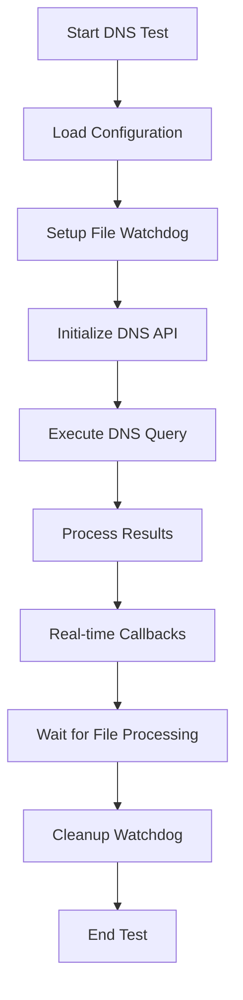

# UR-NetBench-MANN Source Code Workflow Guide

## Table of Contents
1. [Overview](#overview)
2. [Architecture](#architecture)
3. [Core Components](#core-components)
4. [Thread Launching Mechanism](#thread-launching-mechanism)
5. [Argument Passing System](#argument-passing-system)
6. [Real-time Data Collection](#real-time-data-collection)
7. [Test Workflow](#test-workflow)
8. [Configuration Management](#configuration-management)
9. [File Monitoring System](#file-monitoring-system)
10. [Server Status Monitoring](#server-status-monitoring)
11. [API Integration](#api-integration)
12. [Error Handling](#error-handling)
13. [Performance Considerations](#performance-considerations)
14. [Code Examples](#code-examples)
15. [Best Practices](#best-practices)

## Overview

UR-NetBench-MANN is a comprehensive network benchmarking framework designed for testing various network protocols and services including DNS, traceroute, ping, and iperf. The system is built with a modular architecture that emphasizes real-time data collection, multi-threaded execution, and robust error handling.

### Key Features
- **Multi-threaded execution** with comprehensive thread management
- **Real-time data collection** and monitoring
- **Modular test workers** for different network protocols
- **File-based monitoring** using watchdog threads
- **Server status monitoring** with concurrent testing
- **JSON-based configuration** system
- **Extensive logging** and error reporting

## Architecture

The system follows a layered architecture with clear separation of concerns:

```
┌─────────────────────────────────────────────────────────────┐
│                    Application Layer                        │
├─────────────────────────────────────────────────────────────┤
│  main.cpp → OperationWorker.cpp → TestWorkers.cpp          │
├─────────────────────────────────────────────────────────────┤
│                    Management Layer                         │
├─────────────────────────────────────────────────────────────┤
│  ThreadManager │ ConfigManager │ FileWatchdog │ ServersStatus │
├─────────────────────────────────────────────────────────────┤
│                     API Layer                               │
├─────────────────────────────────────────────────────────────┤
│  DNS API │ Traceroute API │ Ping API │ Iperf API           │
├─────────────────────────────────────────────────────────────┤
│                   System Layer                              │
└─────────────────────────────────────────────────────────────┘
```

### Design Principles
1. **Separation of Concerns**: Each component has a specific responsibility
2. **Thread Safety**: All shared resources are properly synchronized
3. **Modularity**: Components can be developed and tested independently
4. **Extensibility**: New test types can be easily added
5. **Real-time Processing**: Data is processed as it becomes available

## Core Components

### 1. Main Application (main.cpp)
The entry point responsible for:
- Command-line argument parsing
- Signal handling for graceful shutdown
- Thread manager initialization
- Operation worker orchestration

**Key Responsibilities:**
```cpp
// Signal handling setup
setup_signal_handlers();

// Configuration loading
ConfigManager config_manager;
config_manager.loadPackageConfig(package_config_file);
config_manager.validateConfig();

// Thread manager creation
g_thread_manager = std::make_unique<ThreadManager>(10);

// Operation worker thread creation
unsigned int thread_id = g_thread_manager->createThread(
    [](ThreadMgr::ThreadManager& tm, const std::string& config_file) {
        operation_worker(tm, config_file);
    },
    std::ref(*g_thread_manager),
    package_config_file
);
```

### 2. Operation Worker (OperationWorker.cpp)
The central orchestrator that:
- Interprets configuration and determines operation type
- Creates appropriate test worker threads
- Manages test execution lifecycle
- Handles server status monitoring operations

**Operation Types:**
- `servers-status`: Monitor multiple servers concurrently
- `dns`: Execute DNS lookup tests
- `traceroute`: Perform network path analysis
- `ping`: Test connectivity and latency
- `iperf`: Measure network throughput

### 3. Test Workers (TestWorkers.cpp)
Specialized workers for each network test type:
- `dns_test_worker()`: DNS resolution testing
- `traceroute_test_worker()`: Network path tracing
- `ping_test_worker()`: Connectivity and latency testing
- `iperf_test_worker()`: Network performance testing

Each worker:
- Sets up real-time file monitoring
- Configures test parameters
- Executes the network test
- Processes results and handles callbacks

### 4. Thread Manager (ThreadManager)
Comprehensive thread management system providing:
- Thread creation and lifecycle management
- Thread registration and identification
- Synchronization primitives
- Process execution capabilities
- Resource cleanup

## Thread Launching Mechanism

### Thread Creation Process

The system uses a sophisticated thread launching mechanism that ensures proper initialization, execution, and cleanup:

#### 1. Thread Manager Initialization
```cpp
// Create thread manager with initial capacity
g_thread_manager = std::make_unique<ThreadManager>(10);
```

#### 2. Thread Creation with Lambda Functions
```cpp
unsigned int thread_id = g_thread_manager->createThread(
    [](ThreadMgr::ThreadManager& tm, const std::string& config_file) {
        operation_worker(tm, config_file);
    },
    std::ref(*g_thread_manager),
    package_config_file
);
```

#### 3. Thread Registration
```cpp
// Register thread with attachment identifier
std::string attachment_id = "operation_worker_thread";
g_thread_manager->registerThread(thread_id, attachment_id);
```

#### 4. Thread Lifecycle Management
```cpp
// Wait for completion with timeout
bool completed = g_thread_manager->joinThread(thread_id, std::chrono::seconds(300));

// Cleanup if needed
if (!completed) {
    g_thread_manager->stopThread(thread_id);
}
```

### Thread Wrapper Implementation

The C-level thread manager implements a wrapper function that handles thread lifecycle:

```c
static void *thread_wrapper(void *arg) {
    thread_info_t *info = (thread_info_t *)arg;
    void *result = NULL;
    
    // Set thread state to running
    pthread_mutex_lock(&info->mutex);
    info->state = THREAD_RUNNING;
    pthread_mutex_unlock(&info->mutex);
    
    // Execute thread function while checking for pause and exit conditions
    while (!info->should_exit) {
        // Check if thread is paused
        pthread_mutex_lock(&info->mutex);
        while (info->is_paused && !info->should_exit) {
            info->state = THREAD_PAUSED;
            pthread_cond_wait(&info->cond, &info->mutex);
        }
        info->state = THREAD_RUNNING;
        pthread_mutex_unlock(&info->mutex);
        
        // If thread should exit, break the loop
        if (info->should_exit) {
            break;
        }
        
        // Execute thread function
        result = info->func(info->arg);
        
        // Break the loop after executing the function once
        break;
    }
    
    // Set thread state to stopped
    pthread_mutex_lock(&info->mutex);
    info->state = THREAD_STOPPED;
    pthread_mutex_unlock(&info->mutex);
    
    return result;
}
```

### Thread States and Transitions

The system maintains thread states throughout their lifecycle:

1. **THREAD_CREATED**: Thread has been created but not yet started
2. **THREAD_RUNNING**: Thread is actively executing
3. **THREAD_PAUSED**: Thread is paused and waiting for resume signal
4. **THREAD_STOPPED**: Thread has completed execution or been stopped
5. **THREAD_ERROR**: Thread encountered an error during execution

## Argument Passing System

### Configuration-Based Argument Passing

The system uses a hierarchical configuration system for passing arguments:

#### 1. Package Configuration Loading
```cpp
ConfigManager config_manager;
if (!config_manager.loadPackageConfig(package_config_file)) {
    return 1;
}
```

#### 2. Test Configuration Extraction
```cpp
json test_config = config_manager.getTestConfig();
std::string output_file = config_manager.getOutputFile();
```

#### 3. Lambda Function Argument Passing
```cpp
thread_id = tm.createThread([](ThreadMgr::ThreadManager& tm_inner, 
                              const json& cfg, 
                              const std::string& out) {
    dns_test_worker(tm_inner, cfg, out);
}, std::ref(tm), test_config, output_file);
```

### JSON Configuration Structure

Arguments are passed through structured JSON configurations:

```json
{
  "operation": "dns",
  "test_config": {
    "hostname": "example.com",
    "query_type": "A",
    "nameserver": "8.8.8.8",
    "timeout_ms": 5000,
    "use_tcp": false,
    "export_file_path": "/tmp/dns_results.json"
  },
  "output_file": "/tmp/final_results.json",
  "servers_list_path": "/tmp/servers.json"
}
```

### Type-Safe Argument Handling

Each test worker validates and converts JSON arguments to appropriate types:

```cpp
void dns_test_worker(ThreadMgr::ThreadManager& thread_manager, 
                    const json& config_json, 
                    const std::string& output_file) {
    try {
        // Deserialize and validate configuration
        NetBench::Shared::DNSConfig dns_config = 
            DNSResultSerializer::deserializeConfig(config_json);
        
        // Override output file if provided
        if (!output_file.empty()) {
            dns_config.export_file_path = output_file;
        }
        
        // Execute test with validated configuration
        // ...
    } catch (const std::exception& e) {
        LOG_ERROR("[DNS Worker] Error: " << e.what() << std::endl);
    }
}
```

## Real-time Data Collection

### File Watchdog System

The system implements a sophisticated file monitoring mechanism for real-time data collection:

#### 1. FileWatchdog Initialization
```cpp
std::unique_ptr<FileWatchdog> watchdog = std::make_unique<FileWatchdog>(
    thread_manager,
    dns_config.export_file_path,
    [](const json& result_json) {
        // Real-time callback for data processing
        process_realtime_data(result_json);
    },
    100  // Poll interval in milliseconds
);
```

#### 2. Watchdog Thread Creation
```cpp
void FileWatchdog::start() {
    running_ = true;
    last_modified_time_ = getLastModifiedTime(file_path_);
    last_file_size_ = getFileSize(file_path_);
    
    // Create monitoring thread
    thread_id_ = thread_manager_.createThread([this]() {
        this->watchLoopJson();
    });
    
    // Register for identification
    std::string attachment = "filewatchdog_" + file_path_;
    thread_manager_.registerThread(thread_id_, attachment);
}
```

#### 3. File Change Detection Loop
```cpp
void FileWatchdog::watchLoopJson() {
    while (running_) {
        time_t current_modified_time = getLastModifiedTime(file_path_);
        off_t current_file_size = getFileSize(file_path_);
        
        // Trigger callback if file changed
        if (current_file_size > 0 && 
            (current_modified_time > last_modified_time_ || 
             current_file_size != last_file_size_)) {
            
            last_modified_time_ = current_modified_time;
            last_file_size_ = current_file_size;
            
            std::string content = readFileContent(file_path_);
            if (!content.empty() && content.length() >= 10 && json_callback_) {
                try {
                    json parsed = json::parse(content);
                    json_callback_(parsed);
                } catch (const json::parse_error& e) {
                    // Ignore incomplete JSON during writing
                }
            }
        }
        
        std::this_thread::sleep_for(std::chrono::milliseconds(poll_interval_ms_));
    }
}
```

### Real-time Data Processing

Each test worker implements specific real-time data processing:

#### DNS Test Real-time Processing
```cpp
[](const json& result_json) {
    try {
        if (!result_json.contains("hostname")) {
            return;
        }
        
        // Extract and format data
        json extracted_data;
        extracted_data["timestamp"] = std::time(nullptr);
        extracted_data["hostname"] = result_json["hostname"];
        extracted_data["query_type"] = result_json["query_type"];
        extracted_data["success"] = result_json["success"];
        extracted_data["query_time_ms"] = result_json["query_time_ms"];
        
        // Process records
        if (result_json.contains("records") && result_json["records"].is_array()) {
            json records_array = json::array();
            for (const auto& record : result_json["records"]) {
                json record_obj;
                record_obj["type"] = record["type"];
                record_obj["value"] = record["value"];
                record_obj["ttl"] = record["ttl"];
                records_array.push_back(record_obj);
            }
            extracted_data["records"] = records_array;
            extracted_data["records_count"] = records_array.size();
        }
        
        // Output real-time data
        LOG_INFO("[DNS Worker] JSON Data: " << extracted_data.dump(2) << std::endl);
        
    } catch (const json::exception& e) {
        LOG_ERROR("[DNS Worker] JSON error: " << e.what() << std::endl);
    }
}
```

#### Ping Test Real-time Processing
```cpp
ping.setRealtimeCallback([](const ::PingRealtimeResult& rt_result) {
    if (rt_result.success) {
        LOG_INFO("[Ping Worker] Seq " << rt_result.sequence 
                  << ": RTT=" << rt_result.rtt_ms << "ms "
                  << "TTL=" << rt_result.ttl << std::endl);
    } else {
        LOG_ERROR("[Ping Worker] Seq " << rt_result.sequence 
                  << ": " << rt_result.error_message << std::endl);
    }
});
```

#### Iperf Test Real-time Processing
```cpp
[](const json& result_json) {
    try {
        json extracted_data;
        extracted_data["timestamp"] = std::time(nullptr);
        
        // Process interval data
        if (result_json.contains("intervals") && result_json["intervals"].is_array()) {
            int total_intervals = result_json["intervals"].size();
            extracted_data["total_intervals"] = total_intervals;
            
            if (total_intervals > 0) {
                const auto& last_interval = result_json["intervals"][total_intervals - 1];
                json interval_info;
                interval_info["interval_number"] = total_intervals;
                
                // Extract performance metrics
                if (last_interval.contains("formatted") && 
                    last_interval["formatted"].contains("sum")) {
                    const auto& sum = last_interval["formatted"]["sum"];
                    interval_info["bitrate"] = sum.value("bits_per_second", "N/A");
                    interval_info["transfer"] = sum.value("bytes", "N/A");
                    interval_info["duration"] = sum.value("duration", "N/A");
                    interval_info["retransmits"] = sum.value("retransmits", "N/A");
                }
                
                extracted_data["latest_interval"] = interval_info;
            }
        }
        
        // Process summary data (test completion)
        if (result_json.contains("summary")) {
            // Handle final test results
            extracted_data["test_complete"] = true;
            // ... extract summary information
        }
        
        LOG_INFO("[Iperf Worker] JSON Data: " << extracted_data.dump(2) << std::endl);
        
    } catch (const json::exception& e) {
        LOG_ERROR("[Iperf Worker] JSON error: " << e.what() << std::endl);
    }
}
```

## Test Workflow

### 1. DNS Test Workflow



**Implementation Details:**
```cpp
void dns_test_worker(ThreadMgr::ThreadManager& thread_manager, 
                    const json& config_json, 
                    const std::string& output_file) {
    try {
        // 1. Configuration loading and validation
        NetBench::Shared::DNSConfig dns_config = 
            DNSResultSerializer::deserializeConfig(config_json);
        
        // 2. Real-time monitoring setup
        std::unique_ptr<FileWatchdog> watchdog;
        if (!dns_config.export_file_path.empty()) {
            watchdog = std::make_unique<FileWatchdog>(
                thread_manager,
                dns_config.export_file_path,
                realtime_callback_function,
                100
            );
            watchdog->start();
        }
        
        // 3. Legacy API configuration
        ::DNSConfig legacy_dns_config;
        legacy_dns_config.hostname = dns_config.hostname;
        legacy_dns_config.query_type = dns_config.query_type;
        // ... other config mappings
        
        // 4. Execute DNS test
        DNSLookupAPI dns;
        dns.setConfig(legacy_dns_config);
        ::DNSResult legacy_result = dns.execute();
        
        // 5. Result processing
        NetBench::Shared::DNSResult result;
        // Convert legacy result to shared format
        
        // 6. Cleanup
        if (watchdog) {
            std::this_thread::sleep_for(std::chrono::milliseconds(1000));
            watchdog->stop();
        }
        
    } catch (const std::exception& e) {
        LOG_ERROR("[DNS Worker] Error: " << e.what() << std::endl);
    }
}
```

### 2. Traceroute Test Workflow

The traceroute test follows a similar pattern but with hop-by-hop processing:

```cpp
void traceroute_test_worker(ThreadMgr::ThreadManager& thread_manager, 
                           const json& config_json, 
                           const std::string& output_file) {
    try {
        // Configuration and setup
        traceroute::TracerouteConfig tr_config = 
            traceroute::TracerouteConfig::from_json(config_json);
        
        // Real-time monitoring
        std::unique_ptr<FileWatchdog> watchdog = setup_watchdog();
        
        // Hop-by-hop callback
        auto hop_callback = [](const traceroute::HopInfo& hop) {
            LOG_INFO("[Traceroute Worker] Hop " << hop.hop_number << ": ");
            if (hop.timeout) {
                LOG_INFO("* * * (timeout)" << std::endl);
            } else {
                LOG_INFO(hop.ip_address);
                if (hop.hostname != hop.ip_address) {
                    LOG_INFO(" (" << hop.hostname << ")");
                }
                LOG_INFO(" - " << hop.rtt_ms << " ms" << std::endl);
            }
        };
        
        // Execute traceroute
        traceroute::Traceroute tracer;
        traceroute::TracerouteResult legacy_result = 
            tracer.execute(tr_config, hop_callback);
        
        // Process results and cleanup
        
    } catch (const std::exception& e) {
        LOG_ERROR("[Traceroute Worker] Error: " << e.what() << std::endl);
    }
}
```

### 3. Ping Test Workflow

Ping testing includes real-time packet-by-packet monitoring:

```cpp
void ping_test_worker(ThreadMgr::ThreadManager& thread_manager, 
                     const json& config_json, 
                     const std::string& output_file) {
    try {
        // Configuration
        NetBench::Shared::PingConfig ping_config = 
            PingResultSerializer::deserializeConfig(config_json);
        
        // Real-time file monitoring
        std::unique_ptr<FileWatchdog> watchdog = setup_watchdog();
        
        // Real-time packet callback
        PingAPI ping;
        ping.setRealtimeCallback([](const ::PingRealtimeResult& rt_result) {
            NetBench::Shared::PingRealtimeResult realtime_result;
            // Convert result format
            
            if (realtime_result.success) {
                LOG_INFO("[Ping Worker] Seq " << realtime_result.sequence 
                          << ": RTT=" << realtime_result.rtt_ms << "ms "
                          << "TTL=" << realtime_result.ttl << std::endl);
            } else {
                LOG_ERROR("[Ping Worker] Seq " << realtime_result.sequence 
                          << ": " << realtime_result.error_message << std::endl);
            }
        });
        
        // Execute ping test
        ::PingResult legacy_result = ping.execute();
        
        // Process final results
        NetBench::Shared::PingResult result;
        // Convert and analyze results
        
        // Display summary
        if (result.success) {
            LOG_INFO("[Ping Worker] Final Results:" << std::endl);
            LOG_INFO("  Destination: " << result.destination << std::endl);
            LOG_INFO("  Packets Sent: " << result.packets_sent << std::endl);
            LOG_INFO("  Packets Received: " << result.packets_received << std::endl);
            LOG_INFO("  Loss: " << result.loss_percentage << "%" << std::endl);
            LOG_INFO("  RTT: min=" << result.min_rtt_ms 
                      << "ms avg=" << result.avg_rtt_ms 
                      << "ms max=" << result.max_rtt_ms << "ms" << std::endl);
        }
        
        // Cleanup
        
    } catch (const std::exception& e) {
        LOG_ERROR("[Ping Worker] Error: " << e.what() << std::endl);
    }
}
```

### 4. Iperf Test Workflow

Iperf testing includes automatic server selection and comprehensive performance monitoring:

```cpp
void iperf_test_worker(ThreadMgr::ThreadManager& thread_manager, 
                      const json& config_json, 
                      const std::string& output_file) {
    try {
        IperfWrapper iperf;
        json iperf_config = config_json;
        
        // Auto-configuration from servers list
        if (need_auto_configuration(iperf_config)) {
            std::string servers_list_path = iperf_config["servers_list_path"];
            json servers_list = load_servers_list(servers_list_path);
            
            json selected_server = select_server(servers_list, iperf_config);
            
            if (need_port) {
                iperf_config["port"] = extract_port(selected_server);
            }
            if (need_options) {
                iperf_config["options"] = selected_server["OPTIONS"];
            }
        }
        
        // Real-time monitoring setup
        std::unique_ptr<FileWatchdog> watchdog = setup_iperf_watchdog();
        
        // Load configuration and run test
        iperf.loadConfig(iperf_config);
        int result = iperf.run();
        
        // Process results
        if (result == 0) {
            LOG_INFO("[Iperf Worker] Test completed successfully!" << std::endl);
        } else {
            std::string error = iperf.getLastError();
            LOG_ERROR("[Iperf Worker] Test failed with code " << result);
            if (!error.empty()) {
                LOG_ERROR(": " << error);
            }
            LOG_ERROR(std::endl);
        }
        
        // Cleanup watchdog
        if (watchdog) {
            watchdog->stop();
        }
        
    } catch (const std::exception& e) {
        LOG_ERROR("[Iperf Worker] Error: " << e.what() << std::endl);
    }
}
```

## Configuration Management

### ConfigManager Class

The `ConfigManager` class provides centralized configuration handling:

```cpp
class ConfigManager {
private:
    json package_config_;
    bool config_loaded_;
    
public:
    // Load and validate configuration
    bool loadPackageConfig(const std::string& config_file_path);
    bool validateConfig() const;
    
    // Access configuration values
    std::string getOperation() const;
    std::string getServersListPath() const;
    std::string getOutputDir() const;
    json getFilters() const;
    json getTestConfig() const;
    std::string getOutputFile() const;
    const json& getPackageConfig() const;
    
private:
    // Helper methods for safe configuration access
    std::string getConfigString(const std::string& key, 
                               const std::string& default_value = "") const;
    json getConfigJson(const std::string& key, 
                      const json& default_value = json::object()) const;
};
```

### Configuration Loading Process

```cpp
bool ConfigManager::loadPackageConfig(const std::string& config_file_path) {
    try {
        std::ifstream file(config_file_path);
        if (!file.is_open()) {
            std::cerr << "[ConfigManager] Error: Cannot open config file: " 
                      << config_file_path << std::endl;
            return false;
        }
        
        file >> package_config_;
        config_loaded_ = true;
        
        return true;
    } catch (const std::exception& e) {
        std::cerr << "[ConfigManager] Error parsing config: " 
                  << e.what() << std::endl;
        return false;
    }
}
```

### Configuration Validation

```cpp
bool ConfigManager::validateConfig() const {
    if (!config_loaded_) {
        std::cerr << "[ConfigManager] Error: No configuration loaded" << std::endl;
        return false;
    }
    
    // Validate required fields
    if (!package_config_.contains("operation")) {
        std::cerr << "[ConfigManager] Error: Missing 'operation' field" << std::endl;
        return false;
    }
    
    std::string operation = package_config_["operation"];
    
    // Validate operation-specific requirements
    if (operation == "servers-status") {
        if (!package_config_.contains("servers_list_path")) {
            std::cerr << "[ConfigManager] Error: servers-status operation requires 'servers_list_path'" << std::endl;
            return false;
        }
    } else if (operation == "dns" || operation == "traceroute" || 
               operation == "ping" || operation == "iperf") {
        if (!package_config_.contains("test_config")) {
            std::cerr << "[ConfigManager] Error: Test operations require 'test_config'" << std::endl;
            return false;
        }
    } else {
        std::cerr << "[ConfigManager] Error: Unknown operation: " << operation << std::endl;
        return false;
    }
    
    return true;
}
```

### Example Configuration Files

#### DNS Test Configuration
```json
{
  "operation": "dns",
  "test_config": {
    "hostname": "google.com",
    "query_type": "A",
    "nameserver": "8.8.8.8",
    "timeout_ms": 5000,
    "use_tcp": false,
    "export_file_path": "/tmp/dns_test_results.json"
  },
  "output_file": "/tmp/dns_final_results.json"
}
```

#### Server Status Configuration
```json
{
  "operation": "servers-status",
  "servers_list_path": "/configs/servers.json",
  "output_dir": "/results/server_status",
  "filters": {
    "continent": "Europe",
    "country": "Germany"
  },
  "output_file": "/results/aggregated_server_status.json"
}
```

## File Monitoring System

### FileWatchdog Architecture

The `FileWatchdog` class provides real-time file monitoring capabilities:

```cpp
class FileWatchdog {
private:
    ThreadMgr::ThreadManager& thread_manager_;
    std::string file_path_;
    Callback callback_;
    JsonCallback json_callback_;
    bool use_json_callback_;
    int poll_interval_ms_;
    std::atomic<bool> running_;
    unsigned int thread_id_;
    time_t last_modified_time_;
    off_t last_file_size_;
    
public:
    // Constructors for different callback types
    FileWatchdog(ThreadMgr::ThreadManager& thread_manager,
                const std::string& file_path, 
                Callback callback, 
                int poll_interval_ms = 100);
                
    FileWatchdog(ThreadMgr::ThreadManager& thread_manager,
                const std::string& file_path, 
                JsonCallback json_callback, 
                int poll_interval_ms = 100);
    
    // Lifecycle management
    void start();
    void stop();
    bool isRunning() const;
    
private:
    // Monitoring loops
    void watchLoopRaw();
    void watchLoopJson();
    
    // File system utilities
    time_t getLastModifiedTime(const std::string& file_path);
    off_t getFileSize(const std::string& file_path);
    std::string readFileContent(const std::string& file_path);
};
```

### File Change Detection Algorithm

The monitoring system uses a dual-criteria approach for detecting file changes:

```cpp
void FileWatchdog::watchLoopJson() {
    while (running_) {
        time_t current_modified_time = getLastModifiedTime(file_path_);
        off_t current_file_size = getFileSize(file_path_);
        
        // Trigger callback if either timestamp OR file size changed
        if (current_file_size > 0 && 
            (current_modified_time > last_modified_time_ || 
             current_file_size != last_file_size_)) {
            
            // Update tracking variables
            last_modified_time_ = current_modified_time;
            last_file_size_ = current_file_size;
            
            // Read and process file content
            std::string content = readFileContent(file_path_);
            if (!content.empty() && content.length() >= 10 && json_callback_) {
                try {
                    json parsed = json::parse(content);
                    json_callback_(parsed);
                } catch (const json::parse_error& e) {
                    // Silently ignore parse errors from incomplete JSON
                } catch (const std::exception& e) {
                    LOG_ERROR("[FileWatchdog] Error processing JSON: " << e.what() << std::endl);
                }
            }
        }
        
        // Sleep before next check
        std::this_thread::sleep_for(std::chrono::milliseconds(poll_interval_ms_));
    }
}
```

### Thread-Safe File Operations

```cpp
std::string FileWatchdog::readFileContent(const std::string& file_path) {
    std::ifstream file(file_path);
    if (!file.is_open()) {
        return "";
    }
    
    std::stringstream buffer;
    buffer << file.rdbuf();
    return buffer.str();
}

time_t FileWatchdog::getLastModifiedTime(const std::string& file_path) {
    struct stat file_stat;
    if (stat(file_path.c_str(), &file_stat) == 0) {
        return file_stat.st_mtime;
    }
    return 0;
}

off_t FileWatchdog::getFileSize(const std::string& file_path) {
    struct stat file_stat;
    if (stat(file_path.c_str(), &file_stat) == 0) {
        return file_stat.st_size;
    }
    return 0;
}
```

## Server Status Monitoring

### ServersStatusMonitor Architecture

The server status monitoring system provides concurrent monitoring of multiple servers:

```cpp
class ServersStatusMonitor {
private:
    std::vector<ServerInfo> servers_;
    std::vector<ServerStatus> server_statuses_;
    std::unique_ptr<ThreadMgr::ThreadManager> thread_manager_;
    std::atomic<bool> monitoring_active_;
    std::string output_dir_;
    
    // Thread synchronization
    std::mutex status_mutex_;
    std::condition_variable status_cv_;
    
public:
    explicit ServersStatusMonitor(const std::string& output_dir);
    ~ServersStatusMonitor();
    
    // Configuration and lifecycle
    bool loadServersConfig(const std::string& config_file_path);
    bool startMonitoring();
    void stopMonitoring();
    
    // Status management
    void displayContinuousStatus(int refresh_interval_sec);
    void exportAggregatedResults(const std::string& output_file);
    
private:
    // Individual server monitoring
    void monitorServer(const ServerInfo& server);
    void updateServerStatus(const std::string& server_id, 
                           const ServerStatus& status);
    
    // Utility methods
    std::string generateServerOutputPath(const ServerInfo& server) const;
    void createOutputDirectory(const std::string& path) const;
};
```

### Server Configuration Loading

```cpp
bool ServersStatusMonitor::loadServersConfig(const std::string& config_file_path) {
    std::ifstream file(config_file_path);
    if (!file.is_open()) {
        LOG_ERROR("[ServersStatus] Error: Cannot open config file: " 
                  << config_file_path << std::endl);
        return false;
    }

    try {
        json config;
        file >> config;

        if (!config.is_array()) {
            LOG_ERROR("[ServersStatus] Error: Config must be an array of servers" << std::endl);
            return false;
        }

        servers_.clear();
        int server_count = 0;

        for (const auto& server_json : config) {
            ServerInfo server;

            // Extract server information
            server.host = server_json.value("IP/HOST", "");
            
            if (server_json.contains("PORT")) {
                if (server_json["PORT"].is_string()) {
                    server.port = server_json["PORT"].get<std::string>();
                } else if (server_json["PORT"].is_number()) {
                    server.port = std::to_string(server_json["PORT"].get<int>());
                }
            }

            server.continent = server_json.value("CONTINENT", "");
            server.country = server_json.value("COUNTRY", "");
            server.site = server_json.value("SITE", "");
            server.provider = server_json.value("PROVIDER", "");

            if (server.host.empty()) {
                continue;
            }

            // Generate unique server ID
            std::string clean_host = server.host;
            for (char& c : clean_host) {
                if (!isalnum(c) && c != '.') c = '_';
            }
            server.id = clean_host + "_" + std::to_string(server_count++);

            // Set display name and description
            server.name = server.provider.empty() ? server.host : 
                         (server.provider + " - " + server.site);
            if (server.name.length() > 40) {
                server.name = server.name.substr(0, 37) + "...";
            }

            server.description = server.continent + "/" + server.country + "/" + server.site;

            // Fast ping configuration for quick testing
            server.ping_interval_sec = 1;
            server.ping_count = 1;

            servers_.push_back(server);
        }

        LOG_INFO("[ServersStatus] Loaded " << servers_.size() << " servers" << std::endl);
        return true;

    } catch (const std::exception& e) {
        LOG_ERROR("[ServersStatus] Error parsing server config: " << e.what() << std::endl);
        return false;
    }
}
```

### Concurrent Server Monitoring

```cpp
bool ServersStatusMonitor::startMonitoring() {
    if (servers_.empty()) {
        LOG_ERROR("[ServersStatus] No servers configured for monitoring" << std::endl);
        return false;
    }

    monitoring_active_ = true;
    
    // Create monitoring thread for each server
    for (const auto& server : servers_) {
        unsigned int thread_id = thread_manager_->createThread(
            [this, server]() {
                this->monitorServer(server);
            }
        );
        
        // Register thread with server-specific attachment
        std::string attachment = "server_monitor_" + server.id;
        thread_manager_->registerThread(thread_id, attachment);
        
        LOG_INFO("[ServersStatus] Started monitoring thread for: " << server.host 
                  << " (Thread ID: " << thread_id << ")" << std::endl);
    }

    return true;
}
```

### Individual Server Monitoring Logic

```cpp
void ServersStatusMonitor::monitorServer(const ServerInfo& server) {
    while (monitoring_active_) {
        try {
            ServerStatus status;
            status.server_id = server.id;
            status.timestamp = std::time(nullptr);
            
            // Execute ping test
            ::PingConfig ping_config;
            ping_config.destination = server.host;
            ping_config.count = server.ping_count;
            ping_config.timeout_ms = 5000;
            ping_config.interval_ms = 1000;
            
            std::string output_file = generateServerOutputPath(server);
            ping_config.export_file_path = output_file;
            
            PingAPI ping;
            ping.setConfig(ping_config);
            ::PingResult ping_result = ping.execute();
            
            // Convert to shared format
            status.ping_success = ping_result.success;
            status.ip_address = ping_result.ip_address;
            status.packets_sent = ping_result.packets_sent;
            status.packets_received = ping_result.packets_received;
            status.loss_percentage = ping_result.loss_percentage;
            status.avg_rtt_ms = ping_result.avg_rtt_ms;
            status.min_rtt_ms = ping_result.min_rtt_ms;
            status.max_rtt_ms = ping_result.max_rtt_ms;
            status.error_message = ping_result.error_message;
            
            // Update shared status
            updateServerStatus(server.id, status);
            
            // Export individual server results
            ServerStatusProgressSerializer::serialize(status, output_file);
            
        } catch (const std::exception& e) {
            LOG_ERROR("[ServersStatus] Error monitoring server " << server.host 
                      << ": " << e.what() << std::endl);
            
            ServerStatus error_status;
            error_status.server_id = server.id;
            error_status.timestamp = std::time(nullptr);
            error_status.ping_success = false;
            error_status.error_message = e.what();
            
            updateServerStatus(server.id, error_status);
        }
        
        // Wait for next monitoring cycle
        std::this_thread::sleep_for(std::chrono::seconds(server.ping_interval_sec));
    }
}
```

### Thread-Safe Status Updates

```cpp
void ServersStatusMonitor::updateServerStatus(const std::string& server_id, 
                                              const ServerStatus& status) {
    std::lock_guard<std::mutex> lock(status_mutex_);
    
    // Find existing status or create new one
    auto it = std::find_if(server_statuses_.begin(), server_statuses_.end(),
                          [&server_id](const ServerStatus& s) {
                              return s.server_id == server_id;
                          });
    
    if (it != server_statuses_.end()) {
        *it = status;  // Update existing status
    } else {
        server_statuses_.push_back(status);  // Add new status
    }
    
    // Notify waiting threads
    status_cv_.notify_all();
}
```

## API Integration

### Third-Party API Wrappers

The system integrates multiple network testing APIs through wrapper classes:

#### DNS API Integration
```cpp
// Legacy DNS API configuration
::DNSConfig legacy_dns_config;
legacy_dns_config.hostname = dns_config.hostname;
legacy_dns_config.query_type = dns_config.query_type;
legacy_dns_config.nameserver = dns_config.nameserver;
legacy_dns_config.timeout_ms = dns_config.timeout_ms;
legacy_dns_config.use_tcp = dns_config.use_tcp;
legacy_dns_config.export_file_path = dns_config.export_file_path;

// Execute DNS query
DNSLookupAPI dns;
dns.setConfig(legacy_dns_config);
::DNSResult legacy_result = dns.execute();

// Convert to shared format
NetBench::Shared::DNSResult result;
result.hostname = legacy_result.hostname;
result.query_type = legacy_result.query_type;
result.success = legacy_result.success;
result.error_message = legacy_result.error_message;
result.nameserver = legacy_result.nameserver;
result.query_time_ms = legacy_result.query_time_ms;

for (const auto& rec : legacy_result.records) {
    NetBench::Shared::DNSRecord record;
    record.type = rec.type;
    record.value = rec.value;
    record.ttl = rec.ttl;
    result.records.push_back(record);
}
```

#### Traceroute API Integration
```cpp
// Configuration from JSON
traceroute::TracerouteConfig tr_config = 
    traceroute::TracerouteConfig::from_json(config_json);

// Hop-by-hop callback for real-time monitoring
auto hop_callback = [](const traceroute::HopInfo& hop) {
    LOG_INFO("[Traceroute Worker] Hop " << hop.hop_number << ": ");
    if (hop.timeout) {
        LOG_INFO("* * * (timeout)" << std::endl);
    } else {
        LOG_INFO(hop.ip_address);
        if (hop.hostname != hop.ip_address) {
            LOG_INFO(" (" << hop.hostname << ")");
        }
        LOG_INFO(" - " << hop.rtt_ms << " ms" << std::endl);
    }
};

// Execute traceroute
traceroute::Traceroute tracer;
traceroute::TracerouteResult legacy_result = tracer.execute(tr_config, hop_callback);

// Convert to shared format
TracerouteResult result;
result.target = legacy_result.target;
result.resolved_ip = legacy_result.resolved_ip;
result.success = legacy_result.success;
result.error_message = legacy_result.error_message;

for (const auto& hop : legacy_result.hops) {
    HopInfo hop_info;
    hop_info.hop_number = hop.hop_number;
    hop_info.ip_address = hop.ip_address;
    hop_info.hostname = hop.hostname;
    hop_info.rtt_ms = hop.rtt_ms;
    hop_info.timeout = hop.timeout;
    result.hops.push_back(hop_info);
}
```

#### Ping API Integration
```cpp
// Legacy configuration
::PingConfig legacy_ping_config;
legacy_ping_config.destination = ping_config.destination;
legacy_ping_config.count = ping_config.count;
legacy_ping_config.timeout_ms = ping_config.timeout_ms;
legacy_ping_config.interval_ms = ping_config.interval_ms;
legacy_ping_config.packet_size = ping_config.packet_size;
legacy_ping_config.ttl = ping_config.ttl;
legacy_ping_config.resolve_hostname = ping_config.resolve_hostname;
legacy_ping_config.export_file_path = ping_config.export_file_path;

// Real-time packet callback
PingAPI ping;
ping.setRealtimeCallback([](const ::PingRealtimeResult& rt_result) {
    NetBench::Shared::PingRealtimeResult realtime_result;
    realtime_result.sequence = rt_result.sequence;
    realtime_result.rtt_ms = rt_result.rtt_ms;
    realtime_result.ttl = rt_result.ttl;
    realtime_result.success = rt_result.success;
    realtime_result.error_message = rt_result.error_message;

    if (realtime_result.success) {
        LOG_INFO("[Ping Worker] Seq " << realtime_result.sequence 
                  << ": RTT=" << realtime_result.rtt_ms << "ms "
                  << "TTL=" << realtime_result.ttl << std::endl);
    } else {
        LOG_ERROR("[Ping Worker] Seq " << realtime_result.sequence 
                  << ": " << realtime_result.error_message << std::endl);
    }
});

// Execute ping test
::PingResult legacy_result = ping.execute();

// Convert results
NetBench::Shared::PingResult result;
result.destination = legacy_result.destination;
result.ip_address = legacy_result.ip_address;
result.packets_sent = legacy_result.packets_sent;
result.packets_received = legacy_result.packets_received;
result.packets_lost = legacy_result.packets_lost;
result.loss_percentage = legacy_result.loss_percentage;
result.min_rtt_ms = legacy_result.min_rtt_ms;
result.max_rtt_ms = legacy_result.max_rtt_ms;
result.avg_rtt_ms = legacy_result.avg_rtt_ms;
result.stddev_rtt_ms = legacy_result.stddev_rtt_ms;
result.rtt_times = legacy_result.rtt_times;
result.sequence_numbers = legacy_result.sequence_numbers;
result.ttl_values = legacy_result.ttl_values;
result.success = legacy_result.success;
result.error_message = legacy_result.error_message;
```

#### Iperf API Integration
```cpp
// Iperf wrapper with auto-configuration
IperfWrapper iperf;
json iperf_config = config_json;

// Auto-select server and port if needed
if (need_auto_configuration(iperf_config)) {
    std::string servers_list_path = iperf_config["servers_list_path"];
    std::ifstream servers_file(servers_list_path);
    
    if (servers_file.is_open()) {
        json servers_list;
        servers_file >> servers_list;
        
        if (servers_list.is_array() && !servers_list.empty()) {
            json selected_server = servers_list[0];  // Select first available
            
            // Extract port information
            if (need_port && selected_server.contains("PORT")) {
                std::string port_field = selected_server["PORT"].is_string() ? 
                                        selected_server["PORT"].get<std::string>() : 
                                        std::to_string(selected_server["PORT"].get<int>());
                
                size_t dash_pos = port_field.find('-');
                int port = 5201;  // Default
                try {
                    if (dash_pos != std::string::npos) {
                        port = std::stoi(port_field.substr(0, dash_pos));
                    } else {
                        port = std::stoi(port_field);
                    }
                } catch (const std::exception& e) {
                    port = 5201;  // Fallback to default
                }
                
                iperf_config["port"] = port;
            }
            
            // Extract options
            if (need_options && selected_server.contains("OPTIONS")) {
                iperf_config["options"] = selected_server["OPTIONS"];
            }
        }
    }
}

// Configure real-time monitoring
iperf_config["realtime"] = true;
if (!output_file.empty()) {
    iperf_config["export_results"] = output_file;
}

// Load configuration and execute test
iperf.loadConfig(iperf_config);
int result = iperf.run();

// Handle results
if (result == 0) {
    LOG_INFO("[Iperf Worker] Test completed successfully!" << std::endl);
} else {
    std::string error = iperf.getLastError();
    LOG_ERROR("[Iperf Worker] Test failed with code " << result);
    if (!error.empty()) {
        LOG_ERROR(": " << error);
    }
    LOG_ERROR(std::endl);
}
```

## Error Handling

### Comprehensive Error Management

The system implements multi-layered error handling:

#### 1. Thread-Level Error Handling
```cpp
void dns_test_worker(ThreadMgr::ThreadManager& thread_manager, 
                    const json& config_json, 
                    const std::string& output_file) {
    try {
        // Main execution logic
        // ...
        
    } catch (const json::exception& e) {
        LOG_ERROR("[DNS Worker] JSON error: " << e.what() << std::endl);
    } catch (const std::exception& e) {
        LOG_ERROR("[DNS Worker] Error: " << e.what() << std::endl);
    }
}
```

#### 2. Configuration Error Handling
```cpp
bool ConfigManager::loadPackageConfig(const std::string& config_file_path) {
    try {
        std::ifstream file(config_file_path);
        if (!file.is_open()) {
            std::cerr << "[ConfigManager] Error: Cannot open config file: " 
                      << config_file_path << std::endl;
            return false;
        }
        
        file >> package_config_;
        config_loaded_ = true;
        
        return true;
    } catch (const std::exception& e) {
        std::cerr << "[ConfigManager] Error parsing config: " 
                  << e.what() << std::endl;
        return false;
    }
}
```

#### 3. Thread Manager Error Handling
```cpp
int thread_create(thread_manager_t *manager, void *(*func)(void *), 
                 void *arg, unsigned int *thread_id) {
    if (!manager || !func) {
        ERROR_LOG("Invalid parameters");
        return -1;
    }
    
    // Lock and validate
    pthread_mutex_lock(&manager->mutex);
    
    // Check capacity and resize if needed
    if (manager->thread_count >= manager->capacity) {
        if (resize_thread_array(manager) != 0) {
            pthread_mutex_unlock(&manager->mutex);
            return -1;
        }
    }
    
    // Create thread info structure
    thread_info_t *info = (thread_info_t *)malloc(sizeof(thread_info_t));
    if (!info) {
        ERROR_LOG("Failed to allocate memory for thread info");
        pthread_mutex_unlock(&manager->mutex);
        return -1;
    }
    
    // Initialize and create thread
    // ...
    
    if (pthread_create(&info->thread_id, NULL, thread_wrapper, info) != 0) {
        ERROR_LOG("Failed to create thread");
        // Cleanup on failure
        pthread_mutex_destroy(&info->mutex);
        pthread_cond_destroy(&info->cond);
        free(info);
        pthread_mutex_unlock(&manager->mutex);
        return -1;
    }
    
    // Success path
    // ...
    return info->id;
}
```

#### 4. File Watchdog Error Handling
```cpp
void FileWatchdog::watchLoopJson() {
    while (running_) {
        try {
            // File monitoring logic
            // ...
            
            std::string content = readFileContent(file_path_);
            if (!content.empty() && content.length() >= 10 && json_callback_) {
                try {
                    json parsed = json::parse(content);
                    json_callback_(parsed);
                } catch (const json::parse_error& e) {
                    // Silently ignore parse errors from incomplete JSON during writing
                } catch (const std::exception& e) {
                    LOG_ERROR("[FileWatchdog] Error processing JSON: " << e.what() << std::endl);
                }
            }
            
        } catch (const std::exception& e) {
            LOG_ERROR("[FileWatchdog] Error in monitoring loop: " << e.what() << std::endl);
        }
        
        std::this_thread::sleep_for(std::chrono::milliseconds(poll_interval_ms_));
    }
}
```

### Signal Handling for Graceful Shutdown

```cpp
std::atomic<bool> g_interrupted(false);

void signal_handler(int signal) {
    std::cout << "\nReceived signal " << signal << ". Shutting down gracefully..." << std::endl;
    g_interrupted = true;
}

void setup_signal_handlers() {
    struct sigaction sa;
    sa.sa_handler = signal_handler;
    sigemptyset(&sa.sa_mask);
    sa.sa_flags = 0;
    
    sigaction(SIGINT, &sa, NULL);
    sigaction(SIGTERM, &sa, NULL);
    sigaction(SIGPIPE, &sa, NULL);
}
```

## Performance Considerations

### Thread Pool Management

The system uses efficient thread pool management:

```cpp
// Thread manager with configurable initial capacity
g_thread_manager = std::make_unique<ThreadManager>(10);

// Dynamic array resizing when needed
static int resize_thread_array(thread_manager_t *manager) {
    unsigned int new_capacity = manager->capacity * GROWTH_FACTOR;
    thread_info_t **new_threads = (thread_info_t **)realloc(
        manager->threads, new_capacity * sizeof(thread_info_t *));
    
    if (!new_threads) {
        ERROR_LOG("Failed to resize thread array");
        return -1;
    }
    
    // Initialize new memory to NULL
    for (unsigned int i = manager->capacity; i < new_capacity; i++) {
        new_threads[i] = NULL;
    }
    
    manager->threads = new_threads;
    manager->capacity = new_capacity;
    
    return 0;
}
```

### Efficient File Monitoring

The file monitoring system is optimized for performance:

```cpp
// Configurable polling interval
FileWatchdog(ThreadMgr::ThreadManager& thread_manager,
            const std::string& file_path, 
            JsonCallback json_callback, 
            int poll_interval_ms = 100)  // Default 100ms

// Dual-criteria change detection to reduce false positives
if (current_file_size > 0 && 
    (current_modified_time > last_modified_time_ || 
     current_file_size != last_file_size_)) {
    
    // Process file changes
}

// Minimal file reading
std::string FileWatchdog::readFileContent(const std::string& file_path) {
    std::ifstream file(file_path);
    if (!file.is_open()) {
        return "";
    }
    
    std::stringstream buffer;
    buffer << file.rdbuf();
    return buffer.str();
}
```

### Memory Management

RAII and smart pointers are used throughout:

```cpp
class ServersStatusMonitor {
private:
    std::unique_ptr<ThreadMgr::ThreadManager> thread_manager_;
    std::vector<ServerInfo> servers_;
    std::vector<ServerStatus> server_statuses_;
    
public:
    explicit ServersStatusMonitor(const std::string& output_dir) 
        : monitoring_active_(false), 
          output_dir_(output_dir) {
        thread_manager_ = std::make_unique<ThreadMgr::ThreadManager>();
        // ...
    }
    
    ~ServersStatusMonitor() {
        stopMonitoring();
        // Automatic cleanup via smart pointers
    }
};
```

### Non-blocking Operations

The system uses non-blocking operations where possible:

```cpp
// Non-blocking pipe setup for process threads
fcntl(info->stdout_pipe[0], F_SETFL, O_NONBLOCK);
fcntl(info->stderr_pipe[0], F_SETFL, O_NONBLOCK);

// Non-blocking process monitoring
while (!info->should_exit) {
    int ret = waitpid(pid, &status, WNOHANG);  // Non-blocking wait
    
    if (ret > 0) {
        // Process has exited
        break;
    } else if (ret < 0) {
        // Error handling
        break;
    }
    
    // Check pause/stop conditions
    // ...
    
    // Sleep briefly to avoid busy-waiting
    struct timespec ts = {0, 50000000}; // 50ms
    nanosleep(&ts, NULL);
}
```

## Code Examples

### Complete DNS Test Example

```cpp
#include "../include/TestWorkers.hpp"
#include "../include/LoggingMacros.hpp"
#include "../include/FileWatchdog.hpp"
#include "../thirdparty/dns-lookup-api/include/DNSLookupAPI.hpp"
#include "../ur-netbench-shared/include/DNSResultSerializer.hpp"

void dns_test_worker(ThreadMgr::ThreadManager& thread_manager, 
                    const json& config_json, 
                    const std::string& output_file) {
    try {
        LOG_INFO("[DNS Worker] DNS test worker started" << std::endl);

        // 1. Configuration loading and validation
        NetBench::Shared::DNSConfig dns_config = 
            DNSResultSerializer::deserializeConfig(config_json);

        if (!output_file.empty()) {
            dns_config.export_file_path = output_file;
        }

        // 2. Real-time file monitoring setup
        std::unique_ptr<FileWatchdog> watchdog;
        if (!dns_config.export_file_path.empty()) {
            LOG_INFO("[DNS Worker] Starting FileWatchdog thread for: " 
                      << dns_config.export_file_path << std::endl);

            watchdog = std::make_unique<FileWatchdog>(
                thread_manager,
                dns_config.export_file_path,
                [](const json& result_json) {
                    try {
                        if (!result_json.contains("hostname")) {
                            return;
                        }

                        // Extract and format data into JSON structure
                        json extracted_data;
                        extracted_data["timestamp"] = std::time(nullptr);
                        extracted_data["hostname"] = result_json["hostname"];
                        extracted_data["query_type"] = result_json["query_type"];
                        extracted_data["success"] = result_json["success"];
                        extracted_data["query_time_ms"] = result_json["query_time_ms"];

                        // Process DNS records
                        if (result_json.contains("records") && 
                            result_json["records"].is_array()) {
                            json records_array = json::array();
                            for (const auto& record : result_json["records"]) {
                                json record_obj;
                                record_obj["type"] = record["type"];
                                record_obj["value"] = record["value"];
                                record_obj["ttl"] = record["ttl"];
                                records_array.push_back(record_obj);
                            }
                            extracted_data["records"] = records_array;
                            extracted_data["records_count"] = records_array.size();
                        } else {
                            extracted_data["records"] = json::array();
                            extracted_data["records_count"] = 0;
                        }

                        // Handle error cases
                        if (!result_json["success"].get<bool>() && 
                            result_json.contains("error_message")) {
                            extracted_data["error_message"] = result_json["error_message"];
                        }

                        // Output real-time data
                        LOG_INFO("[DNS Worker] JSON Data: " 
                                  << extracted_data.dump(2) << std::endl);

                    } catch (const json::exception& e) {
                        LOG_ERROR("[DNS Worker] JSON error in real-time callback: " 
                                  << e.what() << std::endl);
                    } catch (const std::exception& e) {
                        LOG_ERROR("[DNS Worker] Error parsing real-time data: " 
                                  << e.what() << std::endl);
                    }
                },
                100  // Check every 100ms
            );

            watchdog->start();
            LOG_INFO("[DNS Worker] FileWatchdog thread started successfully" << std::endl);
        }

        // 3. Legacy API configuration
        ::DNSConfig legacy_dns_config;
        legacy_dns_config.hostname = dns_config.hostname;
        legacy_dns_config.query_type = dns_config.query_type;
        legacy_dns_config.nameserver = dns_config.nameserver;
        legacy_dns_config.timeout_ms = dns_config.timeout_ms;
        legacy_dns_config.use_tcp = dns_config.use_tcp;
        legacy_dns_config.export_file_path = dns_config.export_file_path;

        // 4. Execute DNS test
        DNSLookupAPI dns;
        dns.setConfig(legacy_dns_config);

        LOG_INFO("[DNS Worker] Starting DNS lookup for: " 
                  << dns_config.hostname << std::endl);
        ::DNSResult legacy_result = dns.execute();

        // 5. Convert results to shared format
        NetBench::Shared::DNSResult result;
        result.hostname = legacy_result.hostname;
        result.query_type = legacy_result.query_type;
        result.success = legacy_result.success;
        result.error_message = legacy_result.error_message;
        result.nameserver = legacy_result.nameserver;
        result.query_time_ms = legacy_result.query_time_ms;

        for (const auto& rec : legacy_result.records) {
            NetBench::Shared::DNSRecord record;
            record.type = rec.type;
            record.value = rec.value;
            record.ttl = rec.ttl;
            result.records.push_back(record);
        }

        // 6. Log results
        if (result.success) {
            LOG_INFO("[DNS Worker] Lookup completed successfully!" << std::endl);
        } else {
            LOG_ERROR("[DNS Worker] Lookup failed: " 
                      << result.error_message << std::endl);
        }

        // 7. Cleanup and shutdown
        if (watchdog) {
            LOG_INFO("[DNS Worker] Waiting for FileWatchdog to process final data..." << std::endl);
            std::this_thread::sleep_for(std::chrono::milliseconds(1000));
            watchdog->stop();
            LOG_INFO("[DNS Worker] FileWatchdog thread stopped" << std::endl);
        }

        LOG_INFO("[DNS Worker] DNS test worker finished" << std::endl);

    } catch (const std::exception& e) {
        LOG_ERROR("[DNS Worker] Error: " << e.what() << std::endl);
    }
}
```

### Complete Server Status Monitoring Example

```cpp
#include "../include/ServersStatusMonitor.hpp"
#include "../include/LoggingMacros.hpp"
#include "../ur-netbench-shared/include/ServerStatusSerializer.hpp"
#include "../thirdparty/ur-ping-api/include/PingAPI.hpp"

class ServersStatusMonitor {
private:
    std::vector<ServerInfo> servers_;
    std::vector<ServerStatus> server_statuses_;
    std::unique_ptr<ThreadMgr::ThreadManager> thread_manager_;
    std::atomic<bool> monitoring_active_;
    std::string output_dir_;
    std::mutex status_mutex_;
    std::condition_variable status_cv_;

public:
    explicit ServersStatusMonitor(const std::string& output_dir) 
        : monitoring_active_(false), output_dir_(output_dir) {
        thread_manager_ = std::make_unique<ThreadMgr::ThreadManager>();

        // Create output directory hierarchy
        size_t pos = 0;
        std::string path;
        while ((pos = output_dir_.find('/', pos)) != std::string::npos) {
            path = output_dir_.substr(0, pos++);
            if (!path.empty()) {
                mkdir(path.c_str(), 0755);
            }
        }
        mkdir(output_dir_.c_str(), 0755);
    }

    bool startMonitoring() {
        if (servers_.empty()) {
            LOG_ERROR("[ServersStatus] No servers configured for monitoring" << std::endl);
            return false;
        }

        monitoring_active_ = true;
        
        // Create monitoring thread for each server
        for (const auto& server : servers_) {
            unsigned int thread_id = thread_manager_->createThread(
                [this, server]() {
                    this->monitorServer(server);
                }
            );
            
            // Register thread with server-specific attachment
            std::string attachment = "server_monitor_" + server.id;
            thread_manager_->registerThread(thread_id, attachment);
            
            LOG_INFO("[ServersStatus] Started monitoring thread for: " << server.host 
                      << " (Thread ID: " << thread_id << ")" << std::endl);
        }

        return true;
    }

    void displayContinuousStatus(int refresh_interval_sec) {
        while (monitoring_active_) {
            std::this_thread::sleep_for(std::chrono::seconds(refresh_interval_sec));
            
            std::lock_guard<std::mutex> lock(status_mutex_);
            
            // Clear screen and display header
            std::cout << "\033[2J\033[H";  // Clear screen and move cursor to top
            std::cout << "========================================" << std::endl;
            std::cout << "Server Status Monitor - Real-time View" << std::endl;
            std::cout << "========================================" << std::endl;
            std::cout << std::left << std::setw(20) << "Server" 
                      << std::setw(15) << "IP Address" 
                      << std::setw(10) << "Status" 
                      << std::setw(10) << "Loss %" 
                      << std::setw(12) << "Avg RTT" 
                      << std::setw(12) << "Min RTT" 
                      << std::setw(12) << "Max RTT" << std::endl;
            std::cout << std::string(91, '-') << std::endl;

            // Display server statuses
            for (const auto& status : server_statuses_) {
                // Find server info for display name
                auto server_it = std::find_if(servers_.begin(), servers_.end(),
                    [&status](const ServerInfo& s) { return s.id == status.server_id; });
                
                if (server_it != servers_.end()) {
                    std::cout << std::left << std::setw(20) << server_it->name 
                              << std::setw(15) << status.ip_address 
                              << std::setw(10) << (status.ping_success ? "UP" : "DOWN")
                              << std::setw(10) << std::fixed << std::setprecision(1) 
                              << status.loss_percentage << "%"
                              << std::setw(12) << std::fixed << std::setprecision(2) 
                              << status.avg_rtt_ms << "ms"
                              << std::setw(12) << std::fixed << std::setprecision(2) 
                              << status.min_rtt_ms << "ms"
                              << std::setw(12) << std::fixed << std::setprecision(2) 
                              << status.max_rtt_ms << "ms" << std::endl;
                }
            }
            
            std::cout << "========================================" << std::endl;
            std::cout << "Last updated: " << std::put_time(std::localtime(&std::time(nullptr)), "%Y-%m-%d %H:%M:%S") << std::endl;
            std::cout << "Press Ctrl+C to stop monitoring" << std::endl;
        }
    }

private:
    void monitorServer(const ServerInfo& server) {
        while (monitoring_active_) {
            try {
                ServerStatus status;
                status.server_id = server.id;
                status.timestamp = std::time(nullptr);
                
                // Execute ping test
                ::PingConfig ping_config;
                ping_config.destination = server.host;
                ping_config.count = server.ping_count;
                ping_config.timeout_ms = 5000;
                ping_config.interval_ms = 1000;
                
                std::string output_file = generateServerOutputPath(server);
                ping_config.export_file_path = output_file;
                
                PingAPI ping;
                ping.setConfig(ping_config);
                ::PingResult ping_result = ping.execute();
                
                // Convert to shared format
                status.ping_success = ping_result.success;
                status.ip_address = ping_result.ip_address;
                status.packets_sent = ping_result.packets_sent;
                status.packets_received = ping_result.packets_received;
                status.loss_percentage = ping_result.loss_percentage;
                status.avg_rtt_ms = ping_result.avg_rtt_ms;
                status.min_rtt_ms = ping_result.min_rtt_ms;
                status.max_rtt_ms = ping_result.max_rtt_ms;
                status.error_message = ping_result.error_message;
                
                // Update shared status
                updateServerStatus(server.id, status);
                
                // Export individual server results
                ServerStatusProgressSerializer::serialize(status, output_file);
                
            } catch (const std::exception& e) {
                LOG_ERROR("[ServersStatus] Error monitoring server " << server.host 
                          << ": " << e.what() << std::endl);
                
                ServerStatus error_status;
                error_status.server_id = server.id;
                error_status.timestamp = std::time(nullptr);
                error_status.ping_success = false;
                error_status.error_message = e.what();
                
                updateServerStatus(server.id, error_status);
            }
            
            // Wait for next monitoring cycle
            std::this_thread::sleep_for(std::chrono::seconds(server.ping_interval_sec));
        }
    }

    void updateServerStatus(const std::string& server_id, const ServerStatus& status) {
        std::lock_guard<std::mutex> lock(status_mutex_);
        
        // Find existing status or create new one
        auto it = std::find_if(server_statuses_.begin(), server_statuses_.end(),
                              [&server_id](const ServerStatus& s) {
                                  return s.server_id == server_id;
                              });
        
        if (it != server_statuses_.end()) {
            *it = status;  // Update existing status
        } else {
            server_statuses_.push_back(status);  // Add new status
        }
        
        // Notify waiting threads
        status_cv_.notify_all();
    }

    std::string generateServerOutputPath(const ServerInfo& server) const {
        return output_dir_ + "/" + server.id + "_status.json";
    }
};
```

## Best Practices

### 1. Thread Safety
- Always use mutexes when accessing shared resources
- Use RAII lock guards (`std::lock_guard`) for automatic mutex management
- Minimize the scope of locks to avoid contention
- Use atomic variables for simple flags and counters

### 2. Error Handling
- Use try-catch blocks around all potentially throwing operations
- Implement specific exception handling for different error types
- Always clean up resources in error paths
- Log errors with sufficient context for debugging

### 3. Resource Management
- Use smart pointers (`std::unique_ptr`, `std::shared_ptr`) for automatic memory management
- Follow RAII principles for all resource types
- Implement proper cleanup in destructors
- Avoid resource leaks in error conditions

### 4. Configuration Management
- Validate all configuration values before use
- Provide sensible defaults for optional parameters
- Use strongly-typed configuration structures
- Implement comprehensive error reporting for configuration issues

### 5. Real-time Processing
- Use non-blocking operations where possible
- Implement efficient change detection algorithms
- Minimize processing time in real-time callbacks
- Use appropriate polling intervals for file monitoring

### 6. Performance Optimization
- Use thread pools for managing concurrent operations
- Implement efficient data structures for large datasets
- Minimize memory allocations in hot paths
- Use appropriate synchronization primitives

### 7. Code Organization
- Follow single responsibility principle
- Use clear and consistent naming conventions
- Implement comprehensive logging throughout the system
- Document complex algorithms and data structures

### 8. Testing and Validation
- Implement unit tests for individual components
- Test error paths and edge cases
- Validate thread safety under concurrent load
- Test system behavior with various configuration scenarios

---

## Conclusion

The UR-NetBench-MANN system represents a sophisticated approach to network benchmarking that emphasizes real-time data collection, robust thread management, and modular design. The architecture provides a solid foundation for extending the system with additional test types and monitoring capabilities while maintaining high performance and reliability.

Key strengths of the system include:
- Comprehensive thread management with lifecycle control
- Real-time data collection through file monitoring
- Modular design supporting multiple network protocols
- Robust error handling and resource management
- Extensive configuration and customization options
- High-performance concurrent execution

The system's design principles and implementation patterns provide valuable insights for building similar network testing and monitoring frameworks.
