# ur-mavcollector Detailed Flowchart

## Overview
This document provides a comprehensive flowchart description of the MAVLink data collection mechanisms implemented in ur-mavcollector, including request packet generation and response handling for each data type.

---

## Main Application Flow

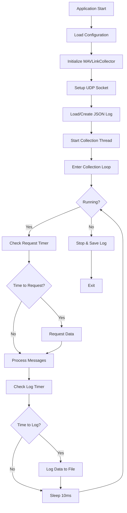

---

## UDP Socket Setup Flow

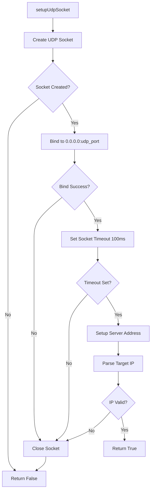

---

## Request Data Flow (Top Level)

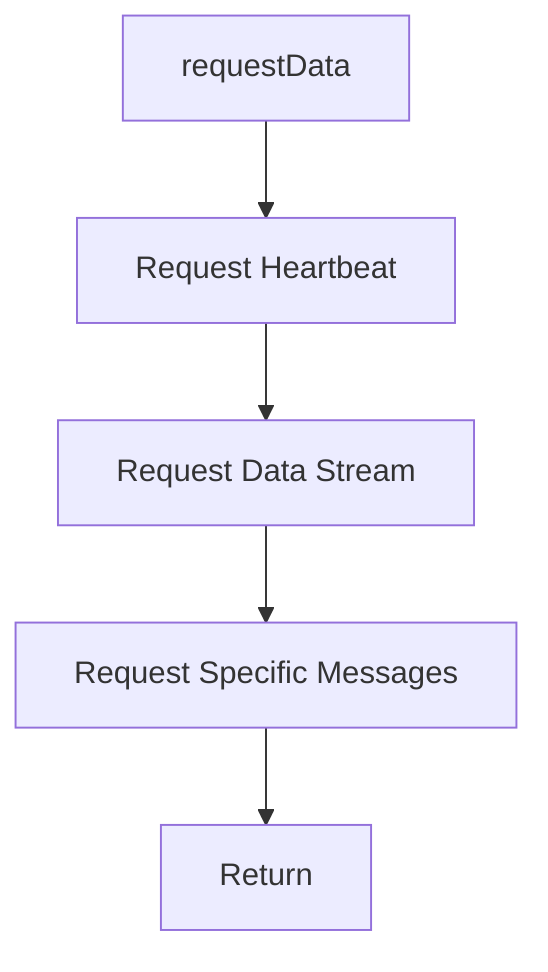

---

## 1. GCS Heartbeat Request Generation

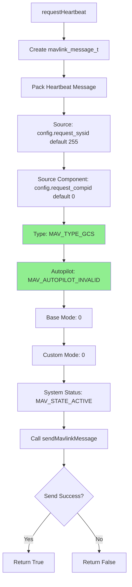

**Packet Structure:**
- **Message ID:** 0 (HEARTBEAT)
- **Payload:** 9 bytes
  - `type` (uint8): 6 = MAV_TYPE_GCS
  - `autopilot` (uint8): 8 = MAV_AUTOPILOT_INVALID
  - `base_mode` (uint8): 0
  - `custom_mode` (uint32): 0
  - `system_status` (uint8): 4 = MAV_STATE_ACTIVE
  - `mavlink_version` (uint8): 3

---

## 2. Legacy Data Stream Request Generation

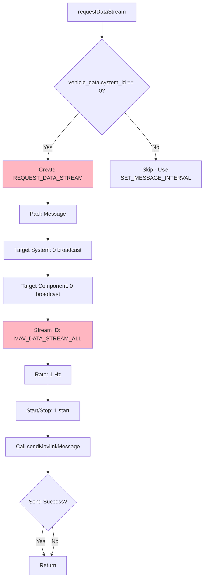

**Packet Structure:**
- **Message ID:** 66 (REQUEST_DATA_STREAM)
- **Payload:** 6 bytes
  - `target_system` (uint8): 0 (broadcast)
  - `target_component` (uint8): 0 (broadcast)
  - `req_stream_id` (uint8): 0 = MAV_DATA_STREAM_ALL
  - `req_message_rate` (uint16): 1 Hz
  - `start_stop` (uint8): 1 = start

**Note:** Only used initially before vehicle system_id is known. Modern approach uses SET_MESSAGE_INTERVAL.

---

## 3. Specific Message Requests Generation

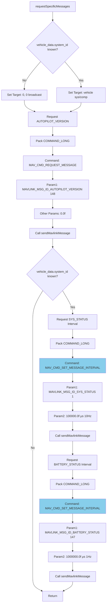

### 3a. AUTOPILOT_VERSION Request Packet

**Packet Structure:**
- **Message ID:** 76 (COMMAND_LONG)
- **Payload:** 33 bytes
  - `target_system` (uint8): 0 or vehicle_data.system_id
  - `target_component` (uint8): 0 or vehicle_data.component_id
  - `command` (uint16): 512 = MAV_CMD_REQUEST_MESSAGE
  - `confirmation` (uint8): 0
  - `param1` (float): 148.0 = MAVLINK_MSG_ID_AUTOPILOT_VERSION
  - `param2-7` (float): 0.0

### 3b. SYS_STATUS Interval Request Packet

**Packet Structure:**
- **Message ID:** 76 (COMMAND_LONG)
- **Payload:** 33 bytes
  - `target_system` (uint8): vehicle_data.system_id
  - `target_component` (uint8): vehicle_data.component_id
  - `command` (uint16): 511 = MAV_CMD_SET_MESSAGE_INTERVAL
  - `confirmation` (uint8): 0
  - `param1` (float): 1.0 = MAVLINK_MSG_ID_SYS_STATUS
  - `param2` (float): 100000.0 (100ms = 10Hz)
  - `param3-7` (float): 0.0

### 3c. BATTERY_STATUS Interval Request Packet

**Packet Structure:**
- **Message ID:** 76 (COMMAND_LONG)
- **Payload:** 33 bytes
  - `target_system` (uint8): vehicle_data.system_id
  - `target_component` (uint8): vehicle_data.component_id
  - `command` (uint16): 511 = MAV_CMD_SET_MESSAGE_INTERVAL
  - `confirmation` (uint8): 0
  - `param1` (float): 147.0 = MAVLINK_MSG_ID_BATTERY_STATUS
  - `param2` (float): 1000000.0 (1s = 1Hz)
  - `param3-7` (float): 0.0

---

## Message Sending Flow

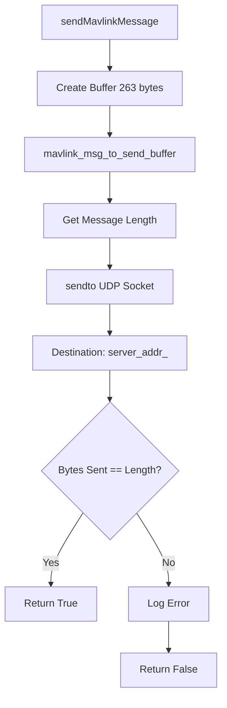

---

## Message Reception & Processing Flow

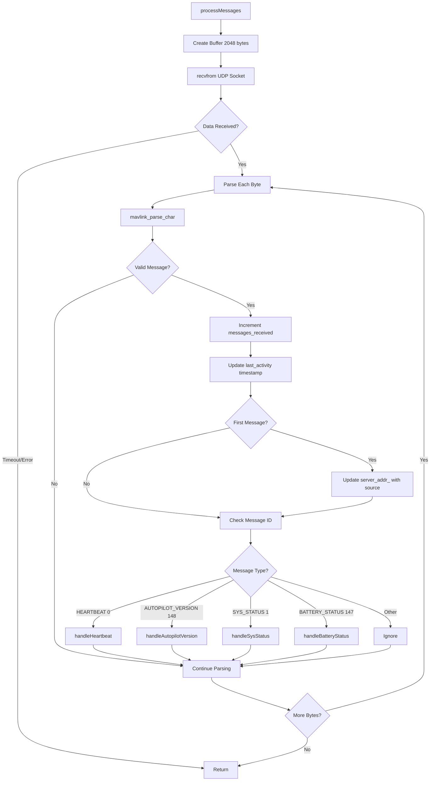

---

## Response Handling: HEARTBEAT (ID: 0)

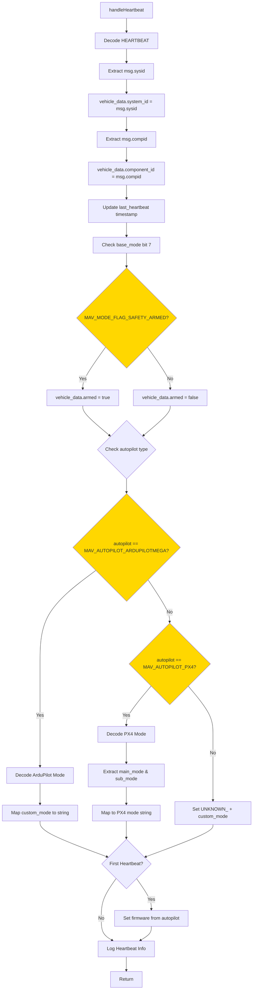

**Response Data Extraction:**
- **system_id:** From message header `msg.sysid`
- **component_id:** From message header `msg.compid`
- **armed:** Bit 7 of `heartbeat.base_mode` (128 = 0x80)
- **flight_mode:** 
  - ArduPilot: `heartbeat.custom_mode` mapped to mode array
  - PX4: Upper byte (main_mode) and lower byte (sub_mode)
- **firmware:** Initial identification from `heartbeat.autopilot` enum

**Validation:**
- No placeholder data used
- `armed` always set (boolean, defaults to false)
- `flight_mode` set only if valid mapping exists, otherwise "UNKNOWN_" + number
- `firmware` set only if autopilot type recognized

---

## Response Handling: AUTOPILOT_VERSION (ID: 148)

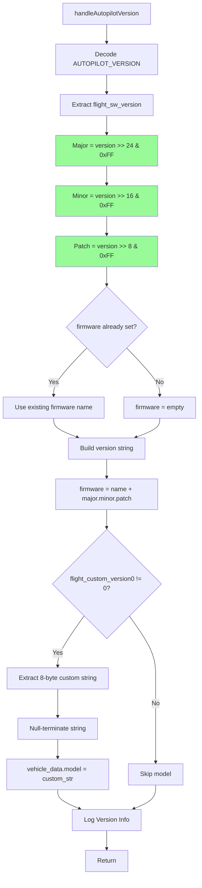

**Response Data Extraction:**
- **flight_sw_version:** 32-bit bitfield
  - Bits 24-31: Major version
  - Bits 16-23: Minor version
  - Bits 8-15: Patch version
  - Bits 0-7: Version type (ignored)
- **flight_custom_version:** 8-byte array for vehicle model name
- **firmware:** Combines existing firmware type + version number

**Validation:**
- Version extracted only if fields are non-zero
- `flight_custom_version[0] != 0` checked before extracting model
- Null-termination ensured for string safety

---

## Response Handling: SYS_STATUS (ID: 1)

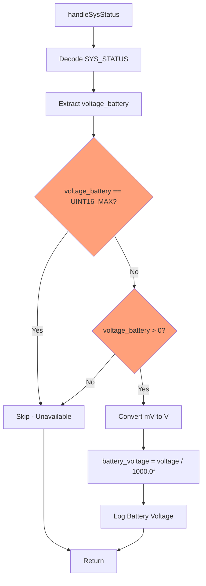

**Response Data Extraction:**
- **voltage_battery:** uint16_t in millivolts
  - Valid range: 1 - 65534
  - 65535 (UINT16_MAX) = unavailable
  - 0 = unavailable/error

**Conversion:**
- mV → V: `voltage_battery / 1000.0f`

**Validation:**
- Check for UINT16_MAX (65535)
- Check for zero value
- Only update if both checks pass
- No placeholder/fallback value used

---

## Response Handling: BATTERY_STATUS (ID: 147)

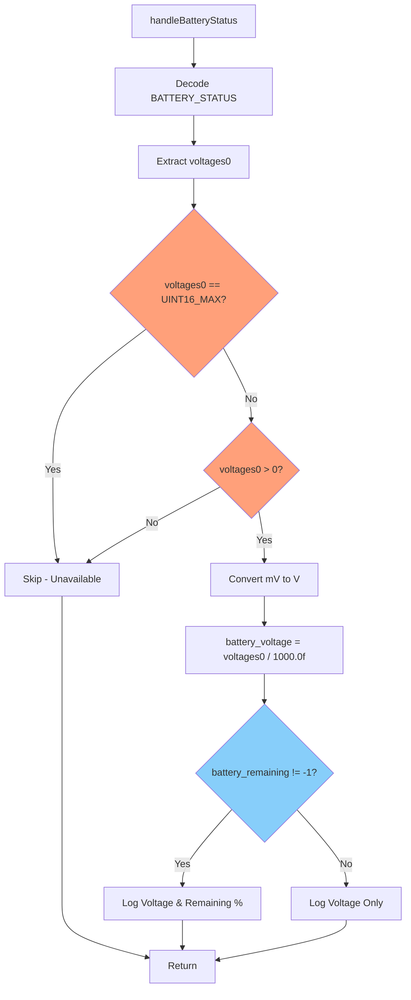

**Response Data Extraction:**
- **voltages[0]:** uint16_t total voltage in millivolts
  - Valid range: 1 - 65534
  - 65535 (UINT16_MAX) = unavailable
  - 0 = unavailable/error
- **battery_remaining:** int8_t percentage (0-100)
  - -1 = unavailable
  - Used for logging only, not stored

**Conversion:**
- mV → V: `voltages[0] / 1000.0f`

**Validation:**
- Check for UINT16_MAX (65535)
- Check for zero value
- Only update if both checks pass
- `battery_remaining` logged if != -1 but not stored

**Priority:**
- BATTERY_STATUS has higher precision than SYS_STATUS
- Both can update `battery_voltage`, last received wins

---

## Data Logging Flow

```mermaid
graph TD
    A[logData] --> B[Get Current Time]
    B --> C[Format Timestamp]
    C --> D[Create/Update JSON]
    D --> E{model available?}
    E -->|Yes| F[log_jsonmodel = model]
    E -->|No| G[Skip model]
    F --> H{system_id != 0?}
    G --> H
    H -->|Yes| I[log_jsonsystem_id = id]
    H -->|No| J[Skip system_id]
    I --> K{component_id != 0?}
    J --> K
    K -->|Yes| L[log_jsoncomponent_id = id]
    K -->|No| M[Skip component_id]
    L --> N{flight_mode available?}
    M --> N
    N -->|Yes| O[log_jsonflight_mode = mode]
    N -->|No| P[Skip flight_mode]
    O --> Q[log_jsonarmed = armed]
    P --> Q
    Q --> R{battery_voltage >= 0?}
    R -->|Yes| S[log_jsonbattery_voltage = voltage]
    R -->|No| T[Skip battery_voltage]
    S --> U{last_heartbeat set?}
    T --> U
    U -->|Yes| V[log_jsonheartbeat = duration]
    U -->|No| W[Skip heartbeat]
    V --> X{firmware available?}
    W --> X
    X -->|Yes| Y[log_jsonfirmware = firmware]
    X -->|No| Z[Skip firmware]
    Y --> AA{last_activity set?}
    Z --> AA
    AA -->|Yes| AB[log_jsonlast_activity = duration]
    AA -->|No| AC[Skip last_activity]
    AB --> AD[log_jsonmessages_per_sec = rate]
    AC --> AD
    AD --> AE[log_jsonlast_update = timestamp]
    AE --> AF[saveLogToFile]
    AF --> AG[Log to Console]
    AG --> AH[Return]
    
    style Q fill:#90EE90
    style E fill:#FFE4B5
    style H fill:#FFE4B5
    style R fill:#FFE4B5
```

**Conditional Logging Rules:**
1. **Always included:**
   - `armed` (boolean, always valid)
   - `messages_per_sec` (calculated value)
   - `last_update` (current timestamp)

2. **Conditionally included:**
   - `model`: Only if not empty
   - `system_id`: Only if != 0
   - `component_id`: Only if != 0
   - `flight_mode`: Only if not empty
   - `battery_voltage`: Only if >= 0.0
   - `heartbeat`: Only if timestamp is set
   - `firmware`: Only if not empty
   - `last_activity`: Only if timestamp is set

---

## Timing & Intervals

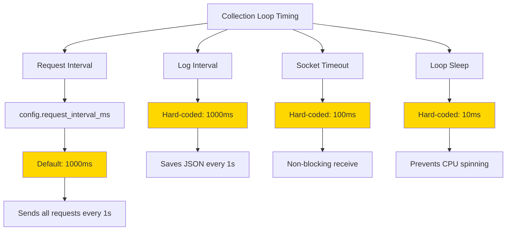

---

## Error Handling & Validation

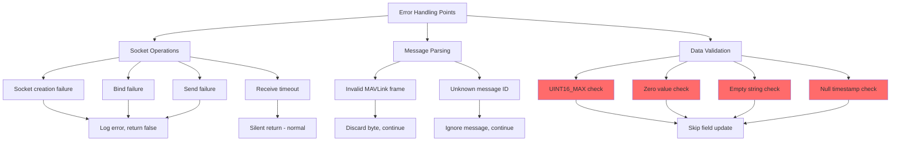

---

## State Transitions

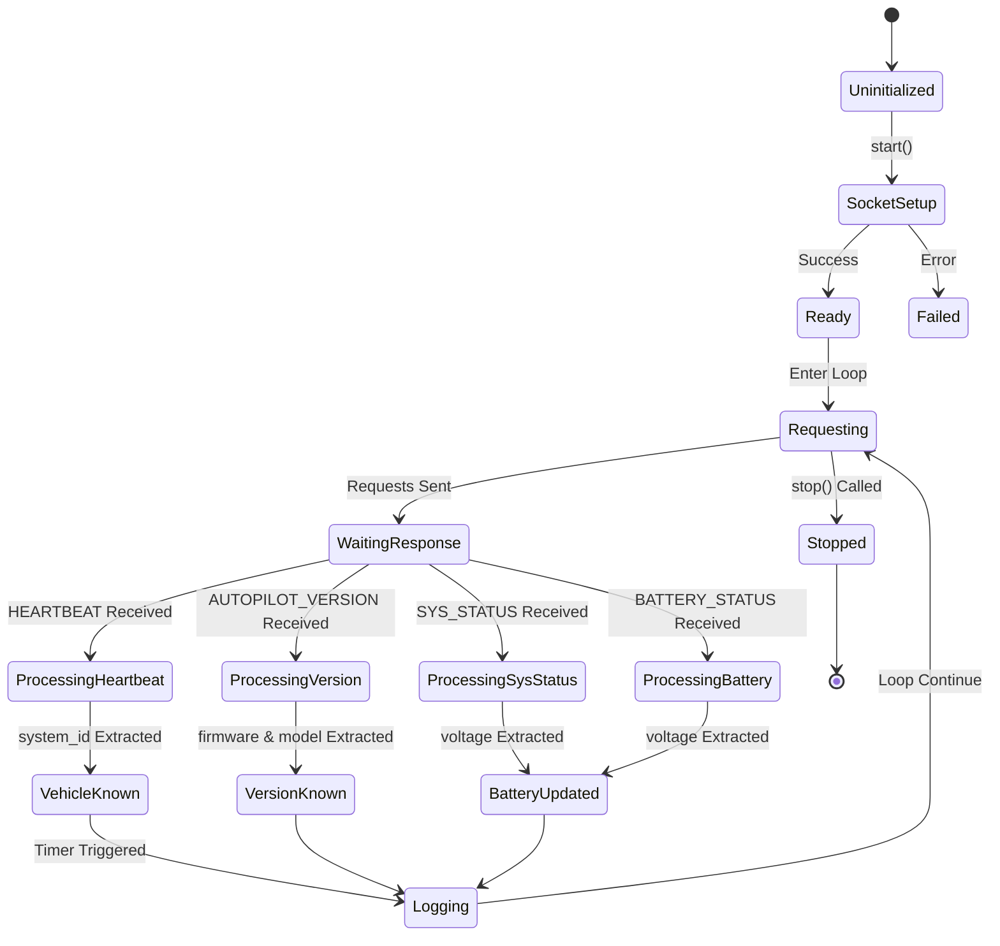

---

## Summary

### Request Generation Summary
1. **GCS Heartbeat (ID 0):** Sent every request interval to identify as GCS
2. **Legacy Stream Request (ID 66):** Only sent when vehicle unknown, broadcasts request for all data
3. **AUTOPILOT_VERSION Request (ID 76):** Always sent, uses broadcast or targeted based on vehicle knowledge
4. **SYS_STATUS Interval (ID 76):** Only sent after vehicle identified, requests 10Hz updates
5. **BATTERY_STATUS Interval (ID 76):** Only sent after vehicle identified, requests 1Hz updates

### Response Handling Summary
1. **HEARTBEAT:** Extracts system/component ID, armed state, flight mode, initial firmware
2. **AUTOPILOT_VERSION:** Extracts detailed firmware version and vehicle model
3. **SYS_STATUS:** Extracts battery voltage (lower precision)
4. **BATTERY_STATUS:** Extracts battery voltage (higher precision) and remaining percentage

### Data Quality Guarantees
- **No Placeholder Data:** All fields checked before inclusion in log
- **Validation:** UINT16_MAX, zero values, empty strings filtered out
- **Conditional Logging:** Only available data written to JSON
- **Timestamp Tracking:** All events timestamped for age calculation
