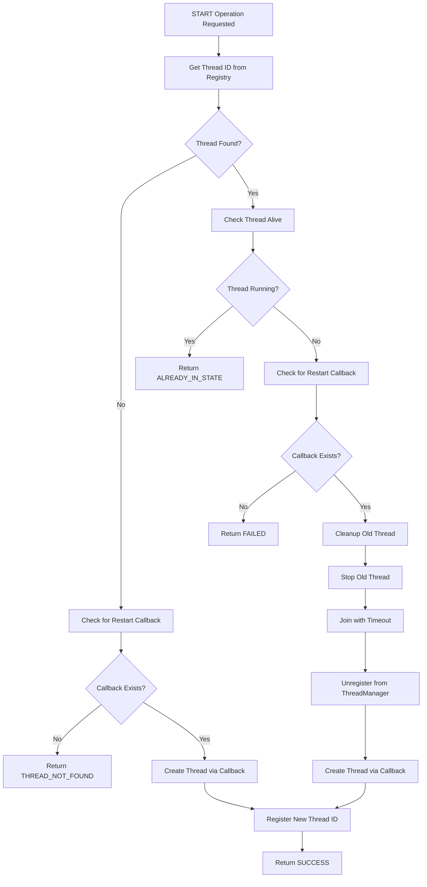
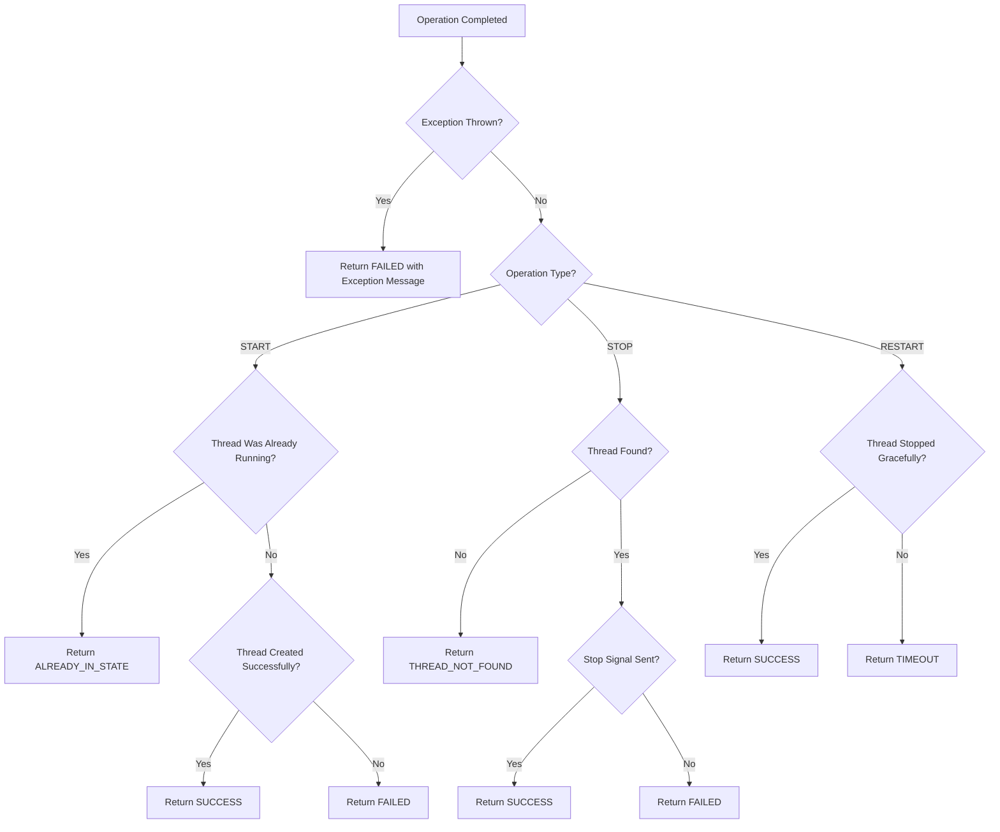

# Thread Operation Logic Flows

## Mainloop Start Operation Flow

### HTTP Endpoint: POST /api/threads/mainloop/start

```mermaid
graph TD
    A[HTTP Request Received] --> B[Parse Request Body]
    B --> C[Extract devicePath & baudrate]
    C --> D[Update Global Router Config]
    D --> E[Call controller->startThread(MAINLOOP)]
    E --> F{Mainloop Start Success?}
    F -->|No| G[Return 500 Error]
    F -->|Yes| H[Wait 200ms for initialization]
    H --> I[Check ExtensionManager Available]
    I --> J{Extensions Exist?}
    J -->|No| K[Call loadExtensionConfigs('config')]
    K --> L[Get All Extensions]
    J -->|Yes| L
    L --> M[Iterate Extensions]
    M --> N{Extension Running?}
    N -->|No| O[Call startExtension(name)]
    N -->|Yes| P[Skip - Already Running]
    O --> Q[Update Extension Status]
    Q --> R[More Extensions?]
    P --> R
    R -->|Yes| M
    R -->|No| S[Return Success Response]
```

### Key Logic Points:

1. **Sequential Dependency**: Extensions are loaded only after successful mainloop startup
2. **Configuration Loading**: `loadExtensionConfigs()` both loads configurations AND creates threads
3. **State Verification**: Each extension's running state is checked and enforced
4. **Error Propagation**: Mainloop failure aborts the entire operation

## Mainloop Stop Operation Flow

### HTTP Endpoint: POST /api/threads/mainloop/stop

```mermaid
graph TD
    A[HTTP Request Received] --> B[Check ExtensionManager Available]
    B --> C[Get All Extensions]
    C --> D[Iterate Extensions]
    D --> E{Extension Running?}
    E -->|Yes| F[Call stopExtension(name)]
    E -->|No| G[Skip - Already Stopped]
    F --> H{Stop Success?}
    H -->|Yes| I[Log Success]
    H -->|No| J[Log Error]
    J --> K[More Extensions?]
    I --> K
    G --> K
    K -->|Yes| D
    K -->|No| L[Call controller->stopThread(MAINLOOP)]
    L --> M[Return Response]
```

### Key Logic Points:

1. **Reverse Order**: Extensions stopped before mainloop to prevent orphaned connections
2. **Graceful Shutdown**: Each extension gets individual shutdown opportunity
3. **Error Isolation**: Individual extension failures don't stop the overall operation

## RPC Controller Start Operation Flow

### Method: executeOperationOnThread(threadName, START)



### Restart Callback Execution Logic:

```cpp
// 1. Resource Cleanup
threadManager_.stopThread(oldThreadId);
threadManager_.joinThread(oldThreadId, std::chrono::milliseconds(500));
threadManager_.unregisterThread(attachmentId);

// 2. Registry Update
threadRegistry_.erase(threadName);
threadAttachments_.erase(threadName);

// 3. Thread Creation
unsigned int newThreadId = restartCallback();

// 4. New Registration
threadRegistry_[threadName] = newThreadId;
threadAttachments_[threadName] = attachmentId;
```

## Extension Start Operation Flow

### Method: ExtensionManager::startExtension(name)

```mermaid
graph TD
    A[startExtension Called] --> B[Lock Extensions Mutex]
    B --> C[Find Extension in Registry]
    C --> D{Extension Found?}
    D -->|No| E[Log Warning & Return False]
    D -->|Yes| F{Extension Already Running?}
    F -->|Yes| G[Log Already Running & Return True]
    F -->|No| H[Check Old Thread ID]
    H --> I{Old Thread Exists?}
    I -->|No| K[Skip Cleanup]
    I -->|Yes| L[Force Cleanup Old Thread]
    L --> M[Stop Old Thread]
    M --> N[Unregister Old Thread]
    N --> O[Wait 200ms for Cleanup]
    O --> K
    K --> P[Call launchExtensionThread(config)]
    P --> Q[Update Extension Info]
    Q --> R[Set isRunning = true]
    R --> S[Log Success & Return True]
```

### Extension Thread Creation Logic:

```cpp
// 1. Thread Function Setup
auto extensionFunc = [config]() {
    // Create isolated mainloop instance
    auto extensionMainloop = std::make_unique<Mainloop>();
    
    // Configure with extension-specific endpoints
    extensionMainloop->add_endpoints(config.extension_thread_config);
    
    // Run the extension event loop
    extensionMainloop->loop();
    
    // Cleanup on exit
    extensionMainloop->teardown();
};

// 2. Thread Creation via ThreadManager
unsigned int threadId = threadManager_.createThread(extensionFunc);

// 3. Registration
std::string attachmentId = "extension_" + config.name;
threadManager_.registerThread(threadId, attachmentId);
```

## Extension Stop Operation Flow

### Method: ExtensionManager::stopExtension(name)

```mermaid
graph TD
    A[stopExtension Called] --> B[Lock Extensions Mutex]
    B --> C[Find Extension in Registry]
    C --> D{Extension Found?}
    D -->|No| E[Log Warning & Return False]
    D -->|Yes| F{Extension Running?}
    F -->|No| G[Log Not Running & Return True]
    F -->|Yes| H[Get Thread ID & Attachment]
    H --> I[Get Extension Mainloop Instance]
    I --> J{Mainloop Instance Valid?}
    J -->|No| K[Force Thread Termination]
    J -->|Yes| L[Graceful Shutdown Path]
    L --> M[Call request_exit(0) on Instance]
    M --> N[Wait for Thread Exit]
    N --> O{Thread Exited Cleanly?}
    O -->|Yes| P[Log Clean Exit]
    O -->|No| Q[Log Timeout Warning]
    Q --> R[Unregister Thread]
    P --> R
    K --> S[Stop Thread Forcefully]
    S --> T[Join with Short Timeout]
    T --> R
    R --> U[Update Extension State]
    U --> V[Set isRunning = false]
    V --> W[Clear mainloopInstance]
    W --> X[Return True]
```

### Graceful vs Forceful Shutdown Logic:

```cpp
// Graceful Path (preferred)
if (extensionMainloop) {
    extensionMainloop->request_exit(0);
    bool exitedCleanly = threadManager_.joinThread(threadId, std::chrono::seconds(5));
    if (exitedCleanly) {
        log_info("Extension exited gracefully");
    } else {
        log_warning("Extension did not exit within timeout");
    }
}

// Forceful Path (fallback)
else {
    threadManager_.stopThread(threadId);
    threadManager_.joinThread(threadId, std::chrono::seconds(2));
}
```

## Thread Target Resolution Logic

### Method: getThreadNamesForTarget(target)

```mermaid
graph TD
    A[Target Resolution Request] --> B{Target Type?}
    B -->|MAINLOOP| C[Check Registry for 'mainloop']
    C --> D{Found in Registry?}
    D -->|Yes| E[Return {'mainloop'}]
    D -->|No| F[Check Callbacks for 'mainloop']
    F --> G{Callback Exists?}
    G -->|Yes| E
    G -->|No| H[Return Empty]
    B -->|HTTP_SERVER| I[Similar Logic for 'http_server']
    B -->|STATISTICS| J[Similar Logic for 'statistics']
    B -->|ALL| K[Get All Registry Threads]
    K --> L[Get All Callback Threads]
    L --> M[Merge and Remove Duplicates]
    M --> N[Return Combined List]
```

## Error Handling Logic Flows

### Operation Status Decision Tree:



### Timeout Handling Logic:

```cpp
// Join with timeout pattern
bool joined = threadManager_.joinThread(threadId, std::chrono::seconds(5));

if (!joined) {
    log_warning("Thread did not stop within timeout");
    
    // Force cleanup for critical operations
    if (operation == RESTART) {
        threadManager_.stopThread(threadId);
        threadManager_.unregisterThread(attachmentId);
        return OperationStatus::TIMEOUT;
    }
    
    // Log but continue for non-critical operations
    if (operation == STOP) {
        log_info("Thread stop requested, continuing...");
        return OperationStatus::SUCCESS;
    }
}
```

## Registry Management Logic

### Thread Registration Pattern:

```cpp
void registerThread(const std::string& threadName, unsigned int threadId, const std::string& attachmentId) {
    std::lock_guard<std::mutex> lock(registryMutex_);
    
    // Store in primary registry
    threadRegistry_[threadName] = threadId;
    
    // Store attachment mapping for ThreadManager operations
    threadAttachments_[threadName] = attachmentId;
    
    // Update thread state
    ThreadStateInfo info = getThreadStateInfo(threadName);
    threadStates_[threadName] = info;
}
```

### Thread Unregistration Pattern:

```cpp
void unregisterThread(const std::string& threadName) {
    std::lock_guard<std::mutex> lock(registryMutex_);
    
    // Remove from all registries
    threadRegistry_.erase(threadName);
    threadAttachments_.erase(threadName);
    threadStates_.erase(threadName);
    
    // Clean up restart callback
    restartCallbacks_.erase(threadName);
}
```

## Configuration Loading Logic

### Extension Configuration Processing:

```mermaid
graph TD
    A[loadExtensionConfigs Called] --> B[Scan Config Directory]
    B --> C[Find 'extension_*.json' Files]
    C --> D[Parse Each JSON File]
    D --> E{Parse Success?}
    E -->|No| F[Log Error & Skip File]
    E -->|Yes| G[Validate Configuration]
    G --> H{Config Valid?}
    H -->|No| I[Log Warning & Skip]
    H -->|Yes| J[Assign Extension Point]
    J --> K[Build Thread Configuration]
    K --> L[Call createExtension(config)]
    L --> M{Create Success?}
    M -->|Yes| N[Log Success]
    M -->|No| O[Log Error]
    O --> P[More Files?]
    N --> P
    F --> P
    I --> P
    P -->|Yes| D
    P -->|No| Q[Return Load Results]
```

### Extension Point Assignment Logic:

```cpp
// Auto-assignment based on type
if (config.type == ExtensionType::INTERNAL) {
    // Find available internal-router-point
    assignedPoint = findAvailableInternalRouterPoint();
} else if (config.type == ExtensionType::UDP) {
    // Find available udp-extension-point
    assignedPoint = findAvailableUdpExtensionPoint();
} else if (config.type == ExtensionType::TCP) {
    // Find available tcp-extension-point
    assignedPoint = findAvailableTcpExtensionPoint();
}

// Validate assignment
if (assignedPoint.empty()) {
    return "No available extension points";
}
```

## Summary of Key Logic Patterns

1. **Dependency-First**: Mainloop must be running before extensions
2. **Graceful-Then-Force**: Always try graceful shutdown first
3. **Registry-Centralized**: All thread operations go through central registry
4. **Callback-Based Restart**: Thread creation logic encapsulated in callbacks
5. **State-Consistent**: Registry updates only after successful operations
6. **Error-Isolated**: Individual component failures don't cascade
7. **Timeout-Protected**: All blocking operations have timeouts
8. **Resource-Tracked**: Every thread creation has corresponding cleanup path
